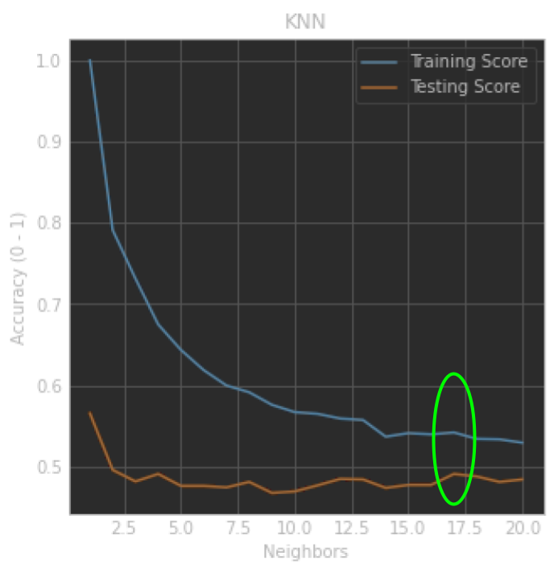
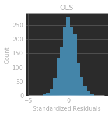
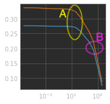
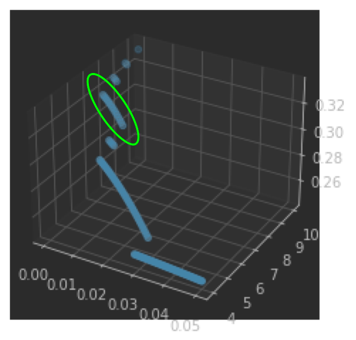

# Homework 1
View [full report here](https://docs.google.com/document/d/e/2PACX-1vRPLcbM_kDK7o3PvQ2M1-cOmR1ovc0Z67xa5wLvC35dKevEwZUmGsUqvJXKSa8gMcQm4yRJ5jsicmUA/pub)

## Objectives
1. Build and analyze simple regression algorithms based on KNN and linear models
2. Identify cases of underfitting and overfitting
3. Select parameters that optimize performance (generalization)

## Problems
For this problem, you will use the Wine Quality database (posted in Blackboard). Use the provided training data subset to train your model and the testing subset to predict and analyze your results.

### KNN
Build and train a KNN Regression model. Vary the parameter K and analyze the results by identifying cases of overfitting and underfitting. Select the optimal value of K. 

### OLS Regression
Build and train an OLS Regression model. Analyze the results and indicate if the learned model is a good choice for this data. 

### Ridge Regression
Build and train a Ridge Regression model. Vary the constraint parameter α and analyze the results by identifying cases of overfitting and underfitting. Select the optimal value of α.

### LASSO Regression
Build and train a LASSO Regression model. Vary the constraint parameter α and analyze the results by identifying cases of overfitting and underfitting. Select the optimal value of α.
